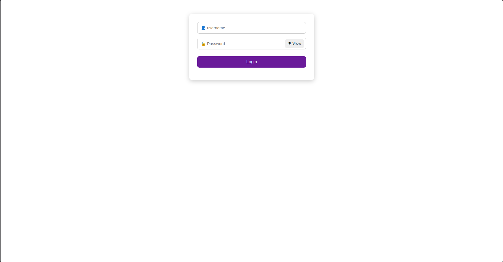
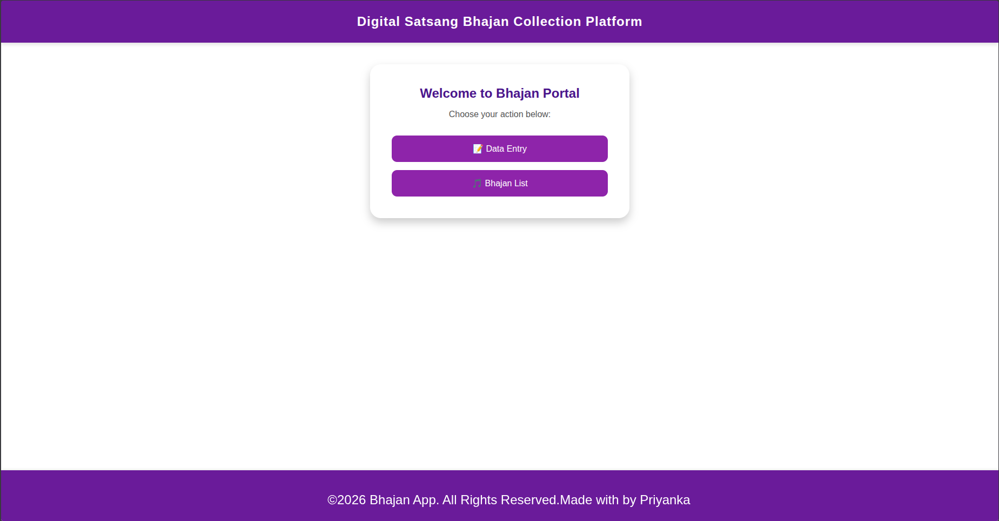
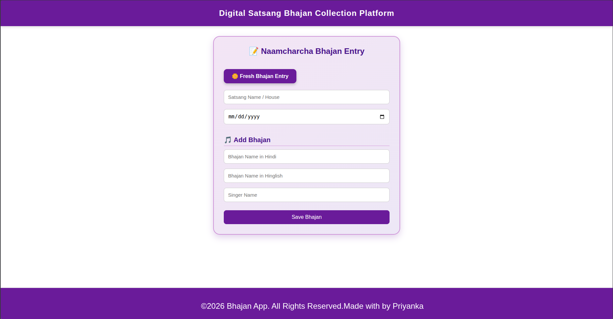
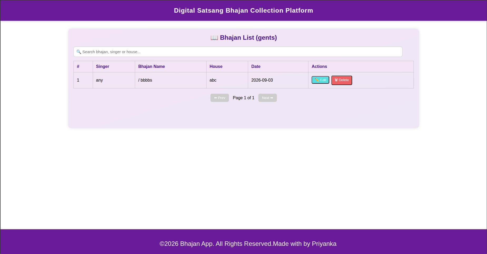

# 🎵 Bhajan App

A simple and efficient web application to manage bhajans for satsangs. This app allows users to add, view, edit, and delete bhajans while ensuring no repetition within a single satsang and maintaining structured records.

---

## 🚀 Features

* Add bhajans with details:

  * Bhajan Name (Hindi / Hinglish)
  * Singer Name
  * House Name (Satsang)
  * Date

* 📋 View all bhajans in a clean table format

* 🔍 Search bhajans (API-based search)

* ✏️ Edit bhajan details using modal popup

* ❌ Delete bhajans with confirmation

* 🔁 Prevent duplicate bhajans in the same satsang

* 📄 Pagination support for large data

---

## 🛠️ Tech Stack

### Frontend

* React.js
* CSS (Custom styling)

### Backend

* Node.js
* Express.js
* MongoDB

### Authentication

* JWT (JSON Web Token)

---

## 🔗 Backend Repository

The backend for this project is available here:

👉 https://github.com/PriyankaVerma2307/vercel-backend

This backend handles:

* Authentication (JWT)
* Bhajan CRUD APIs
* MongoDB database operations

---

## 📂 Project Structure

```
Frontend (separate repo)
Backend (separate repo)
```

> Note: Frontend and backend are maintained in separate repositories.

---

## ⚙️ Installation & Setup

### 🔹 Frontend Setup

```bash
git clone https://github.com/PriyankaVerma2307/vercel-frontend
cd vercel-frontend
npm install
npm start
```

---

### 🔹 Backend Setup

```bash
git clone https://github.com/PriyankaVerma2307/vercel-backend
cd vercel-backend
npm install
```

### Create .env file

Create a `.env` file in the root and add:

```env
PORT=5000
MONGO_URI=your_mongodb_connection_string
JWT_SECRET=your_secret_key
```

### Run backend

```bash
npm start
```

Server will run on:

```
http://localhost:5000
```

---

## 🔐 Login Credentials (Demo)

> You can use the following credentials to login:

* **Email:** gents
* **Password:** Pass123

---

## 📌 Rules Implemented

* ❗ No duplicate bhajan allowed within a single satsang
* 🔄 Bhajans should not repeat until multiple satsangs (future enhancement)
* 📅 Each entry must include house name and date

---

## 📸 Screenshots

### 🔐 Login Page


### 🏠 Home Page


### ➕ Data Entry Page


### 📋 Bhajan List Page


---

## 🎯 Purpose

This project is built to simplify bhajan management during satsangs and avoid repetition while maintaining organized records.

---

## 🙌 Author

Priyanka

---

## ⭐ Note

This project is built for learning.
